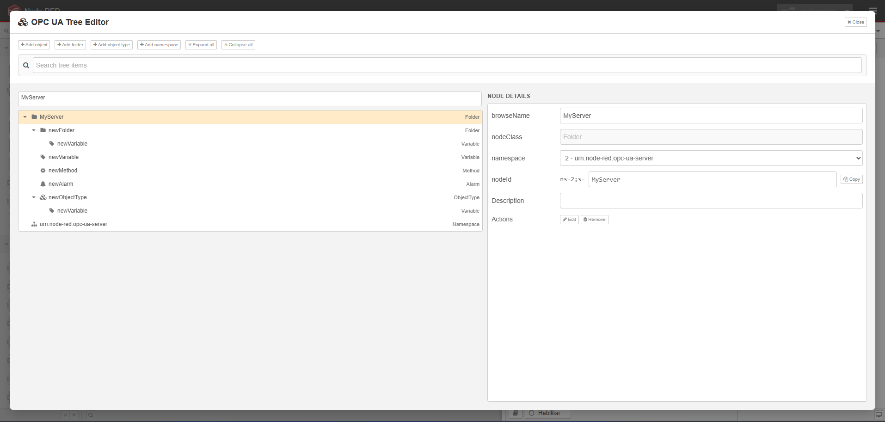
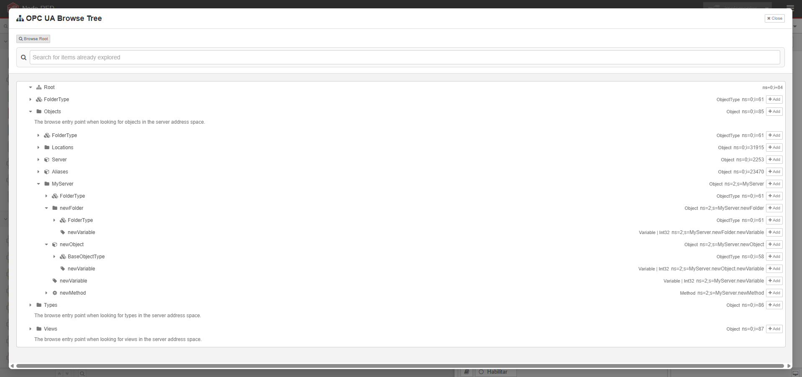

# @vitormnm/node-red-simple-opcua

OPC UA client and server with a simple graphical interface for Node-RED.

This package provides a simplified, highly parameterized set of nodes to establish OPC UA Servers and Clients in Node-RED without complex coding.

---

## Features Overview

- **Dynamic OPC UA Address Space**: Build hierarchical folders, objects, variables, and alarms dynamically from a visual tree editor or JSON.
- **IPC Process Separation**: Server runtime runs in a child process, preventing heavy OPC UA operations from blocking the main Node-RED event loop.
- **Rich Node-RED Integration**: Support for reading, writing, subscribing, calling methods, and managing sessions directly in Node-RED flows.

---

## Server Functionalities

The server implementation consists of two nodes: `opc-ua-server` (the server runtime) and `opcua-server-io` (the data input/output node).

### 1. OPC UA Server (`opc-ua-server`)
This node instantiates the OPC UA Server process.
- **Visual Tree Editor**: Build folders, variables, custom objects, ObjectTypes (templates), alarms, methods, and enumerations visually.
- **Dynamic Address Space**: Rebuild the address space at runtime by passing a new JSON tree configuration in `msg.payload`.
- **Authentication & Authorization**: Configure users, groups, and comma-separated access permissions for folders, variables, and methods.
- **Security Policies**: Supports multiple security policies (`None`, `Basic256Sha256`, `Aes128_Sha256_RsaOaep`, etc.) and security modes (`None`, `Sign`, `SignAndEncrypt`).
- **Certificate Management**: Manage trusted/rejected client certificates.

### 2. Server I/O Node (`opcua-server-io`)
Interacts with an active local server instance. It supports the following modes:
- **Read**: Read values from server variables using a tag path or NodeId.
- **Write**: Write values to server variables.
- **Event**: Fire custom OPC UA events on target nodes.
- **Events**: Stream variable read, write, and alarm events.
- **Status**: Monitor server variable status snapshots.
- **Active Alarms**: Query active alarms on the server.
- **Get Sessions**: Retrieve active OPC UA client sessions.
- **Delete Sessions**: Forcefully close specific active sessions by ID.
- **Method Input / Output**: Route OPC UA method calls from clients into Node-RED flows and return output results.

---

### Supported Variable Data Types, Arrays & Matrices

The server supports the following standard OPC UA data types, including arrays and matrices:

- **Integers**: `Int16`, `UInt16`, `Int32`, `UInt32`, `Int64`
- **Floats**: `Float`
- **Others**: `Boolean`, `String`, `ByteString`
- **Arrays (1D)**: Pass standard JavaScript arrays or JSON arrays as values (e.g., `[1, 2, 3, 4]` or `"[1, 2, 3, 4]"`).
- **Multi-Dimensional Arrays (Matrices)**: Pass nested arrays. The dimensions are automatically detected based on the shape (e.g., `[[1, 2], [3, 4]]` is registered as a 2x2 matrix with dimensions `[2, 2]`, and `[[[1, 2], [3, 4]], [[5, 6], [7, 8]]]` as a 2x2x2 matrix).

*Note on 64-bit Integers (`Int64`/`UInt64`):*
- *Scalars are represented as `[high, low]` arrays (e.g., `[0, 100]` for the value 100).*
- *Arrays of 64-bit integers are represented as arrays of doublets (e.g., `[[0, 100], [0, 200]]`).*
- *They are handled internally using JavaScript `BigInt`.*

---

## Client Functionalities

The client implementation consists of `opcua-client-config` (shared connection configuration) and `opcua-client` (the action node).

### 1. Client Connection Config (`opcua-client-config`)
Manages connection configuration to an external OPC UA server.
- **Connection Strategy**: Limit reconnect retries to fail fast when servers are offline.
- **Authentication**: Supports anonymous or username/password authentication.
- **Session Caching**: Caches and reuse client sessions and method definitions.
- **Address Space Browser**: Provides an endpoint for browsing the server address space directly in the Node-RED editor.

### 2. OPC UA Client (`opcua-client`)
Performs actions on the configured OPC UA server. It operates in the following modes:
- **Read**: Batch read selected variables.
- **Write**: Batch write values with automatic type resolution.
- **Browse**: Browse child nodes of one or more node paths.
- **Browse Recursive**: Recursively search all nodes starting from specified NodeIds, returning resolved type definitions, values, descriptions, and method arguments in optimized batched reads.
- **Method**: Call OPC UA methods on the server.
- **Subscription**: Subscribe to variable value updates (minimum 50ms sampling/publishing).
- **Events**: Subscribe to OPC UA events.

---

## Editor Interfaces

### Server Editor

### Client Editor

---

### Support the Project
If you find this project useful, please support its development:

[@vitormnm](https://vitormiao.com/)

